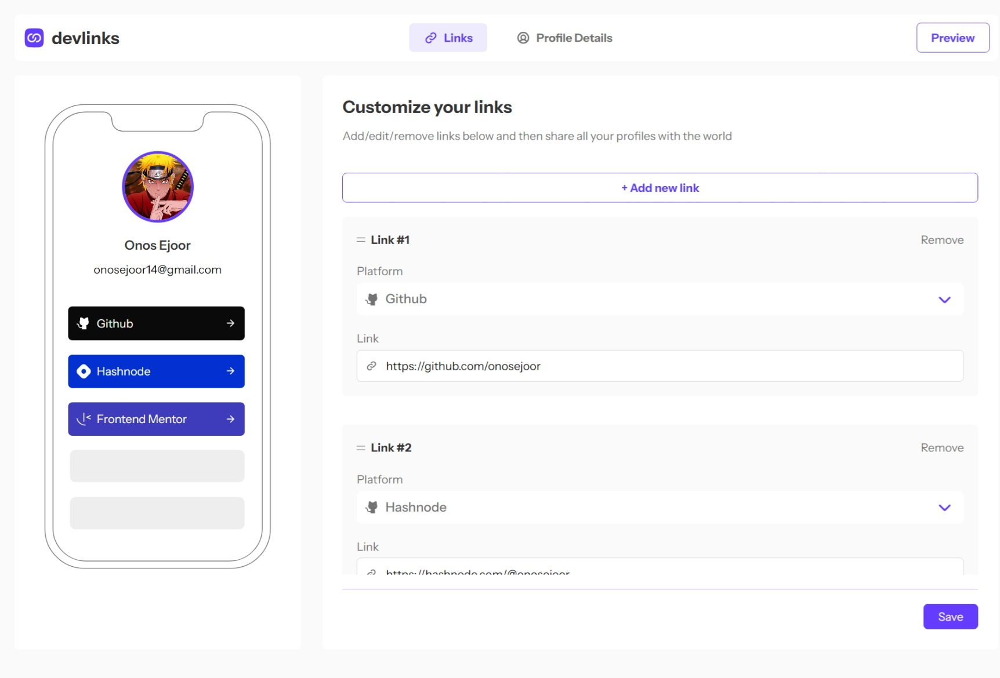

# Frontend Mentor - Link-sharing app solution

This is a solution to the [Link-sharing app challenge on Frontend Mentor](https://www.frontendmentor.io/challenges/linksharing-app-Fbt7yweGsT). Frontend Mentor challenges help you improve your coding skills by building realistic projects. 

## Table of contents

- [Overview](#overview)
  - [The challenge](#the-challenge)
  - [Screenshot](#screenshot)
  - [Links](#links)
  - [Built with](#built-with)
- [Author](#author)

## Overview

### The challenge

Users should be able to:

- Create, read, update, delete links and see previews in the mobile mockup
- Receive validations if the links form is submitted without a URL or with the wrong URL pattern for the platform
- Drag and drop links to reorder them
- Add profile details like profile picture, first name, last name, and email
- Receive validations if the profile details form is saved with no first or last name
- Preview their devlinks profile and copy the link to their clipboard
- View the optimal layout for the interface depending on their device's screen size
- See hover and focus states for all interactive elements on the page
- **Bonus**: Save details to a database (build the project as a full-stack app)
- **Bonus**: Create an account and log in (add user authentication to the full-stack app)

### Screenshot

### Links

- Solution URL: (https://github.com/onosejoor/devlinks)
- Live Site URL: (https://devlinks-umber-two.vercel.app/)

### Built with

- [Next.js](https://nextjs.org/) - React framework
- [Supabase](https://supabase.com/) - Database
- [TailwindCSS](https://tailwindcss.com/) - CSS framework

## Author

- Frontend Mentor - [@onosejoor](https://www.frontendmentor.io/profile/onosejoor)
- Twitter - [@DevText16](https://www.twitter.com/DevText16)
